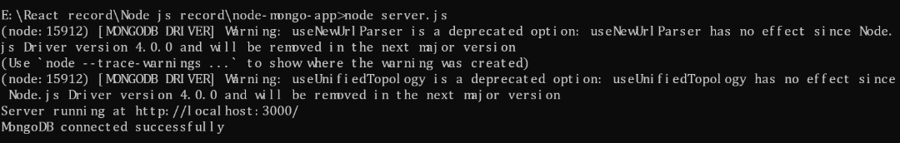
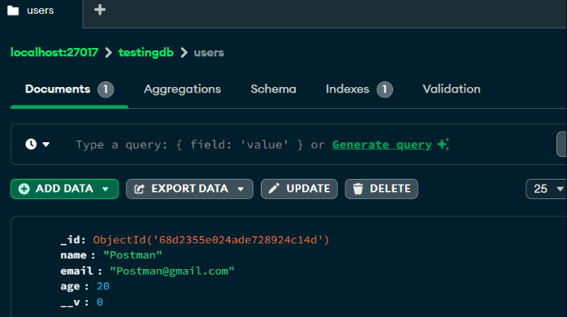

# Experiment 6: Connect Node.js to MongoDB using Mongoose

*Course Outcome (CO3):* Understand how to connect a Node.js application to MongoDB (local or Atlas) using Mongoose.

---
## Screenshots

Here’s a preview of the app:




## Objective

- Install MongoDB (local or Atlas cloud).  
- Install Mongoose in a Node.js project.  
- Connect Node.js application to MongoDB using Mongoose.  
- Test the connection by creating a simple schema and saving a document.  

---

## Prerequisites

- Node.js and npm installed.  
- MongoDB installed locally or Atlas account created.  
- Postman installed.  

---

## Step 1: Setup Project Folder

```bash
cd Desktop
mkdir node-mongo-app
cd node-mongo-app
